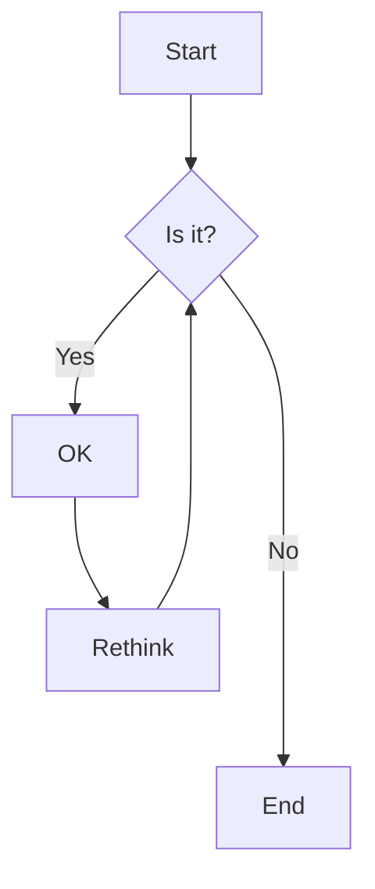
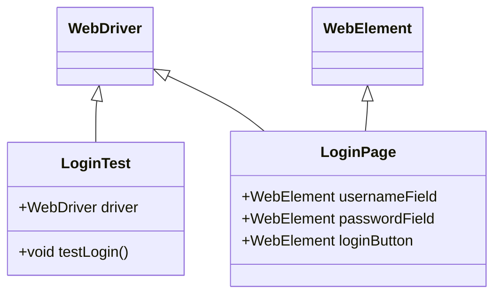
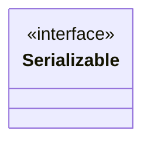
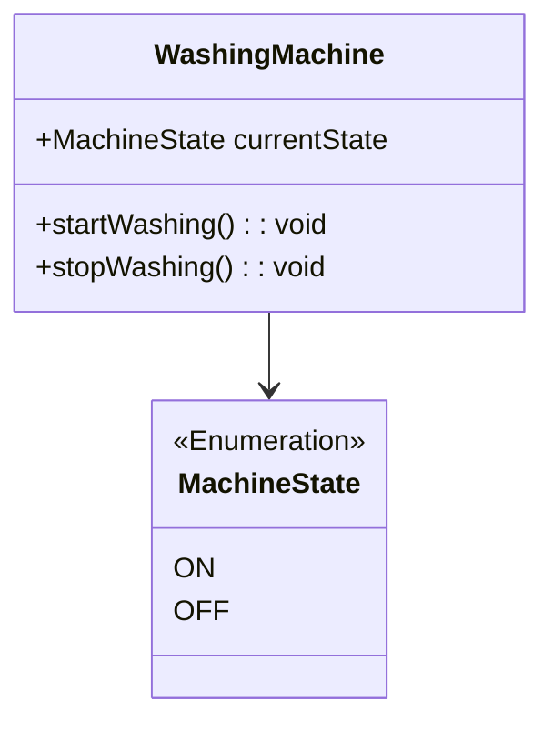
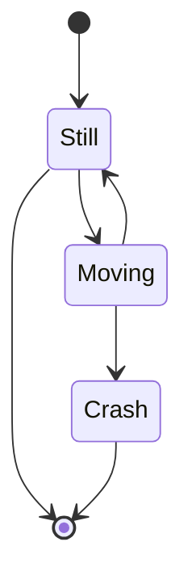

[Mermaid](https://mermaid.js.org/) lets you create diagrams and visualizations using text and code.

<!--more-->



> The featured image credited by: https://mermaid.js.org/.

## Installation

### 1. Import Module

```toml
[[module.imports]]
path = "github.com/hugomods/mermaid"
```

### 2. Import the JavaScript

> Skip this step if your theme supports [HugoPress](https://github.com/razonyang/hugopress).

```go
{{ partial "mermaid/assets/js" . }}
```

## Configuration

The site parameters as following.

| Parameter |  Type  |              Default              | Description             |
| --------- | :----: | :-------------------------------: | ----------------------- |
| `js_url`  | String | Latest version from JS Delivr CDN | The Mermaid script URL. |


[params.mermaid]
js_url = "https://cdn.jsdelivr.net/npm/mermaid@latest/dist/mermaid.esm.min.mjs"


## Usage

### Use Mermaid via Code Block

````markdown
```mermaid
DIAGRAM
```
````

### Use Mermaid via Shortcode

```markdown

DIAGRAM

```

## Examples

### Flowcharts



### Entity Relationship Diagrams


erDiagram
CUSTOMER }|..|{ DELIVERY-ADDRESS : has
CUSTOMER ||--o{ ORDER : places
CUSTOMER ||--o{ INVOICE : "liable for"
DELIVERY-ADDRESS ||--o{ ORDER : receives
INVOICE ||--|{ ORDER : covers
ORDER ||--|{ ORDER-ITEM : includes
PRODUCT-CATEGORY ||--|{ PRODUCT : contains
PRODUCT ||--o{ ORDER-ITEM : "ordered in"


### Class Diagrams







### State Diagrams


