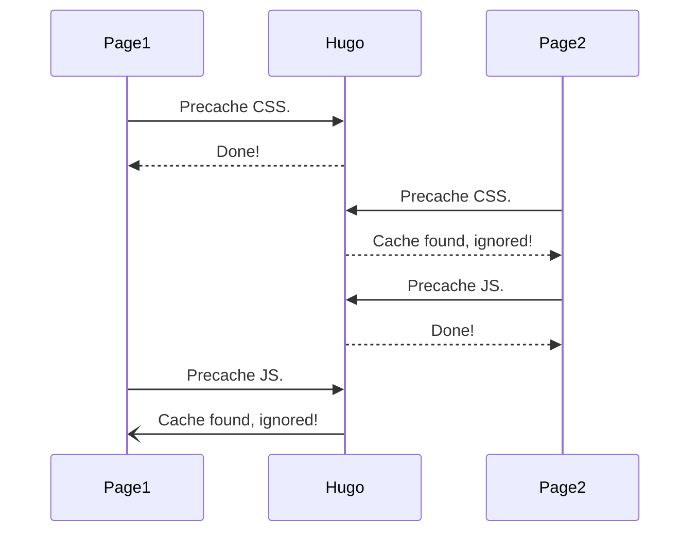

PWAs ([Progressive web apps](https://developer.mozilla.org/en-US/docs/Web/Progressive_web_apps)) are web apps developed using a number of specific technologies and standard patterns to allow them to take advantage of both web and native app features. The PWA module includes preliminary support for Hugo sites, see the [features](#features) below.

<!--more-->



## Features

- Offline available: offline page and offline image.
- Installable: can be added to home screen.
- Precaching: allow precaching pages, CSS, JS, fonts and so on.
- Cache Strategies[^1]: supports cache first, network first and stale while revalidate.

You may still be a bit confused about the features, the following video will show what the module can bring to your sites. You can also give it a shot on our [website](https://hugo.g0f.cn) or the [demo site](https://hugomods.github.io/pwa).



## Installation

This section is for theme developers to integrate this module with their themes.

> There is a [demo site](https://hugomods.github.io/pwa/) and it's [source code](https://github.com/hugomods/pwa/tree/main/exampleSite) to help you get started.

### 1. Import the Module


[[module.imports]]
path = "github.com/hugomods/pwa"


### 2. Import the Meta Partial

The meta partial generate the manifest meta tag to tell browser the location of [web app manifest](https://developer.mozilla.org/en-US/docs/Web/Manifest).

```go-html-template
<head>
  {{ partialCached "pwa/assets/meta" . }}
</head>
```

### 3. Precache CSS and JS

```go-html-template
{{ $css := resources.Get "main.css" }}
<link href="{{ $css.RelPermalink }}" rel="stylesheet" />
{{/* THIS OPERATION CANNOT BE BE CACHED BY partialCached. */}}
{{ partial "pwa/functions/precache" (dict "URL" $css.RelPermalink "Page" .) }}
```

```go-html-template
{{ $js := resources.Get "main.js" }}
<script src="{{ $js.RelPermalink }}"></script>
{{/* THIS OPERATION CANNOT BE BE CACHED BY partialCached. */}}
{{ partial "pwa/functions/precache" (dict "URL" $js.RelPermalink "Page" .) }}
```

As the comments said, `pwa/functions/precache` cannot be cached, since Hugo renders pages concurrently.



The example above shows the case of caching the `pwa/functions/precache` operations.
So far, the `Page1` precaches the CSS, while the `Page2` precaches the JS, in either case, the service worker not aware of all the resources that need to be precached.

### 4. Import the Service Worker Partial

Finally, import the `pwa/assets/sw` partial to generate service worker script.


{}
Please note that this partial should be invoked after precaching assets, such as JS and CSS on step 3. The best practice is that put it before end of the `<body>`.
{}


```go-html-template
<body>
...
{{ partialCached "pwa/assets/sw" . }}
</body>
```

It's recommended to use `partialCached` to cache the partial for getting better build performance.

### 5. Custom the Offline Page

This module provides a built-in offline page with inline style, you can change it by creating the `layouts/_default/index.offline.html` file.

## Usage

This section is for theme users to set up the PWA.

### Site Configuration

Append the `Offline` and `WebAppManifest` format into the `outputs.home`, to generate the offline page and [web app manifest](https://developer.mozilla.org/en-US/docs/Web/Manifest).


outputs:
  home:
    - HTML
    - RSS
    - Offline
    - WebAppManifest


### Site Parameters

| Parameter | Type | Default | Required | Description |
| --------- | :--: | :-----: | :------: | ----------- |
| `debug` | boolean | `false` | - | Whether to enable the debug mode. |
| `icon_path` | string | `images/pwa/icon.png` | - | The icon image relative to the `assets` folder, which used to generate icons in multiple sizes. |
| `icon_sizes` | array<int> | `[48, 64, 128, 144, 256, 512]` | - | The target sizes of icons. |
| `offline_image` | string | `images/pwa/offline.png` | - | The offline image relative to the `assets` folder, which will be shown when request an image offline. |
| `precaches` | array<object> | `[]` | - | Custom precache files. |
| `precaches.url` | string | - | - | The URL of precache file. |
| `caches` | object | - | - | Cache settings. |
| `caches.font` | object | - | - | Font cache settings. |
| `caches.font.origins` | array | `[]` | - | Trusted origins[^2]. |
| `caches.font.strategy` | string | `cache-first` | - | Font cache strategy[^1]. |
| `caches.font.max_age` | string | `2592000` | - | Font cache max age in second. |
| `caches.image` | object | - | - | Image cache settings. |
| `caches.image.origins` | array | `[]` | - | Trusted origins[^2]. |
| `caches.image.strategy` | string | `cache-first` | - | Image cache strategy[^1]. |
| `caches.image.max_age` | string | `2592000` | - | Image cache max age in second. |
| `caches.script` | object | - | - | Script cache settings. |
| `caches.script.origins` | array | `[]` | - | Trusted origins[^2]. |
| `caches.script.strategy` | string | `cache-first` | - | Script cache strategy[^1]. |
| `caches.script.max_age` | string | `2592000` | - | Script cache max age in second. |
| `caches.style` | object | - | - | Style cache settings. |
| `caches.style.origins` | array | `[]` | - | Trusted origins[^2]. |
| `caches.style.strategy` | string | `cache-first` | - | Style cache strategy[^1]. |
| `caches.style.max_age` | string | `2592000` | - | Style cache max age in second. |
| `manifest` | object | - | - | [Manifest](https://developer.mozilla.org/en-US/docs/Mozilla/Add-ons/WebExtensions/manifest.json#list_of_manifest.json_keys) settings, such as `theme_color`, `background_color`.

[^1]: Available strategies: [cache-first](https://developer.chrome.com/docs/workbox/modules/workbox-strategies/#cache-first-cache-falling-back-to-network), [network-first](https://developer.chrome.com/docs/workbox/modules/workbox-strategies/#network-first-network-falling-back-to-cache) and [stale-while-revalidate](https://developer.chrome.com/docs/workbox/modules/workbox-strategies/#stale-while-revalidate).
[^2]: Only trusted third-party origin resources will be cached, such as `https://example.com`, `https://example.org/`.

> This module doesn't provide the built-in icon and offline images, you'll need to save your icon and offline images to corresponding path.


[params.pwa]
debug = false
icon_path = "images/pwa/icon.png"
icon_sizes = [48, 64, 128, 144, 256, 512]
offline_image = "images/pwa/offline.png"

[[params.pwa.precaches]]
url = "/"

[[params.pwa.precaches]]
url = "foo.png"

[params.pwa.caches.font]
strategy = "cache-first"
origins = []
max_age = 2592000 # 30d

[params.pwa.caches.image]
strategy = "cache-first"
origins = []
max_age = 2592000 # 30d

[params.pwa.caches.script]
strategy = "cache-first"
origins = []
max_age = 2592000 # 30d

[params.pwa.caches.style]
strategy = "cache-first"
origins = []
max_age = 2592000 # 30d

[params.pwa.manifest]
background_color = '#ff4088'
theme_color = '#ff4088'


### Best Practice

The default parameters is best for production, but will be bad for development, because you may see a cached, out-of-date page and have to clear the cache or do a force refresh.

But don't worry, we can fix it by changing the default cache strategies[^1] for development environment.


params:
  pwa:
    caches:
      font:
        strategy: network-first
      image:
        strategy: network-first
      script:
        strategy: network-first
      style:
        strategy: network-first

